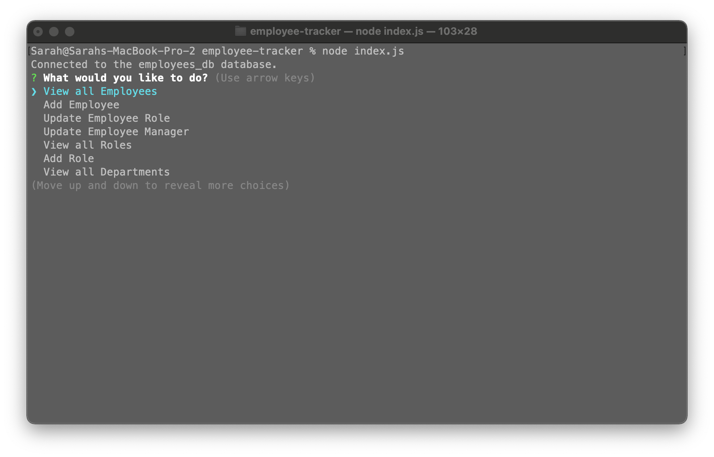
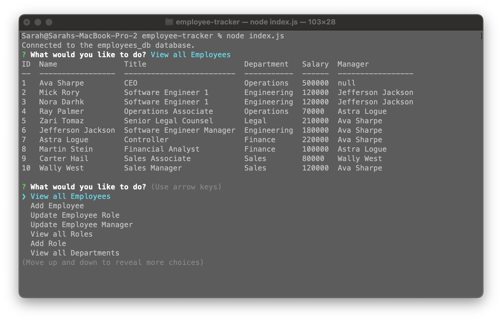
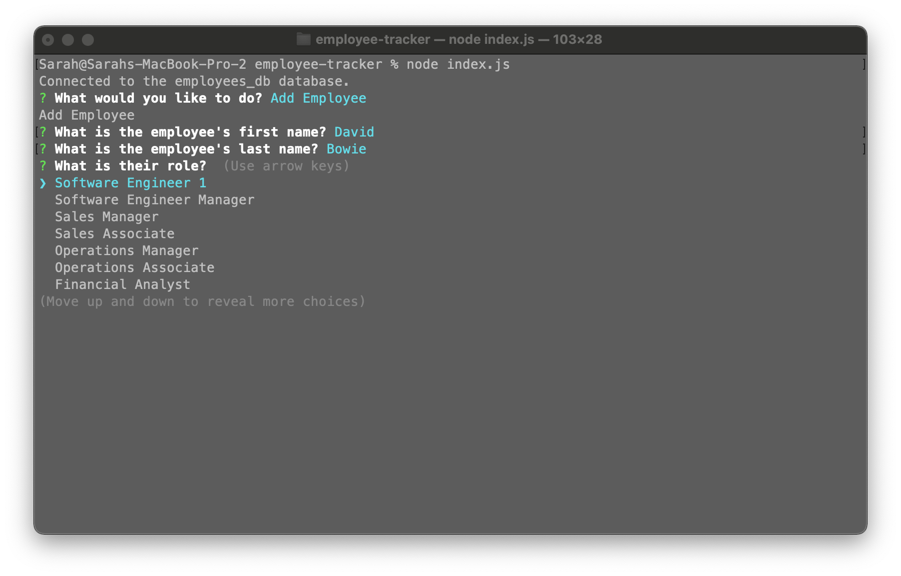
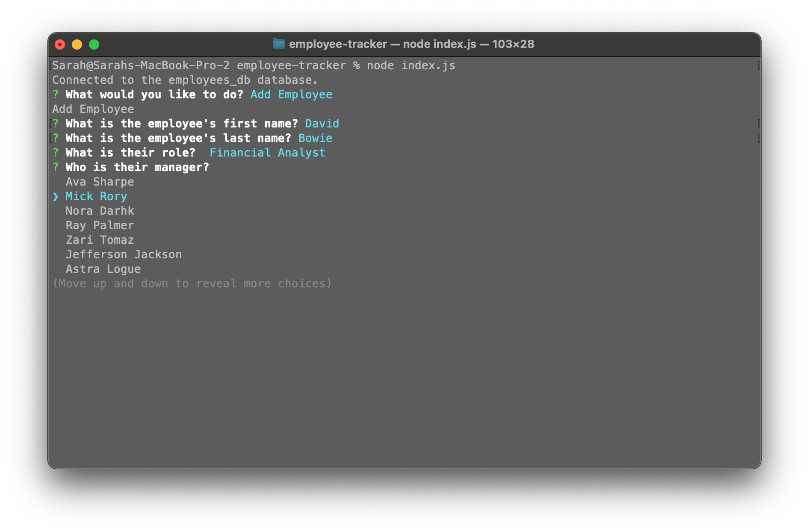

# Employee Tracker
This app is for the busy business owner who needs to efficiently view and manage the departments, roles, and employees in their company so they can organize their business appropriately. An owner isn't going to be manipulating table records in a database directly, so the need to be able to access information through a content management system (CMS), the Employee Tracker app. 

The Employee Tracker is an interface allowing non-developers to easily view and interact with information stored in their employee database. This is a command-line application that allows for management of a company's employee database, using Node.js, Inquirer, and MySQL.

## Summary
* Upon application start, user is presented with several selectable options:
  * View all departments
    * Upon selection: A formatted table is generated showing department names and department ids.
  * View all roles
    * Upon selection: User is presented with the job title, role id, the department to which that role belongs.
  * View all employees
    * Upon selection: A formatted table is generated showing employee data, including employee ids, first names, last names, job titles, departments, salaries, and any managers to which that employees reports.
  * Add a department
    * Upon selection: User is prompted to enter the name of the department and that department is then added to the database.
  * Add a role
    * Upon selection: User is prompted to enter the name, salary, and department for the role. That role is then added to the database.
  * Add an employee.
    * Upon selection: User is prompted to enter the employee’s first name, last name, role, and manager. That employee is then added to the database.
  * Update an employee role
    * Upon selection: User is prompted to select an employee and to update to their role. This information is then updated in the database.

## Employee Tracker Application
[Demo of Employee Tracker application available here.](https://watch.screencastify.com/v/6P9BCGovKZrWmGX89e4S)

Main Menu UI

Rendered Table UI

Add Employee UI 1/2

Add Employee UI 2/2

Employees_Database Schema

## Installation
Ensure you have Node.js installed locally to install packages to and from the public npm registry. [Node.js installation documentation.](https://docs.npmjs.com/downloading-and-installing-node-js-and-npm)

1. Install dependencies `npm install`
Required when when you first set up the project for local development or use OR if any changes are made to the project's dependencies. [More Node information here.](https://nodesource.com/blog/an-absolute-beginners-guide-to-using-npm/)

## Usage
Run this application by:
1. Cloning the repository to your local machine.

2. Once in the root folder in your command line interface, start the application by entering `node index.js`

If you make any changes to the database schema or seed data: 
1. update your mysql shell from the db folder in your terminal with `mysql -u root -p`

3. `source schema.sql` to use the updated schema.

4. `source seeds.sql` to use the updated seed data file.

5. `quit` to exit your mysql shell. At this point the application is ready to be started in your CLI again.

## Techonologies used
* [Inquirer package](https://www.npmjs.com/package/inquirer) - Used for the interactive command line user interface. 
* [Node MySQL 2 package](https://www.npmjs.com/package/mysql2) - MySQL client for Node.js.
* [Console.Table package](https://www.npmjs.com/package/console.table) -  Prints MySQL rows to the console.
* [NPM](https://www.npmjs.com/) - Node package manager, used in conjunction with JS and Inquirer to support application logic and Command Line interface.
* [Node](https://nodejs.org/en/) - Asynchronous event-driven JavaScript runtime environment that executes JavaScript code outside a web browser
* [Javascript](https://developer.mozilla.org/en-US/docs/Web/javascript) - Core app logic
* [Git](https://git-scm.com/doc) - Version control system to track changes to source code
* [GitHub](https://docs.github.com/en) - Hosts the code repository

## Authors
Sarah Hollingsworth
* [Github](https://github.com/sahhollingsworth)
* [LinkedIn](https://www.linkedin.com/in/sarahhollingsworth/)